<div align="center">

# 阿丽小红书排版.skill

<br>

> *"做好一件小事,让别人也能省下半天时间。"*


<br>

**把一篇文章,一键变成小红书图文卡片。**

采用 **New Brutalism(新粗野主义)** 视觉风格——硬核黑框、强烈阴影、
高对比色块、网格底纹。严格执行「视觉高压」排版规范,严禁留白。

兼容 Claude Code / Claude.ai / OpenClaw / OpenCode

<br>

[看效果](#效果预览) · [安装](#安装) · [怎么用](#怎么用) · [自定义](#自定义) · [作者](#作者)

</div>

---

## 效果预览

<div align="center">

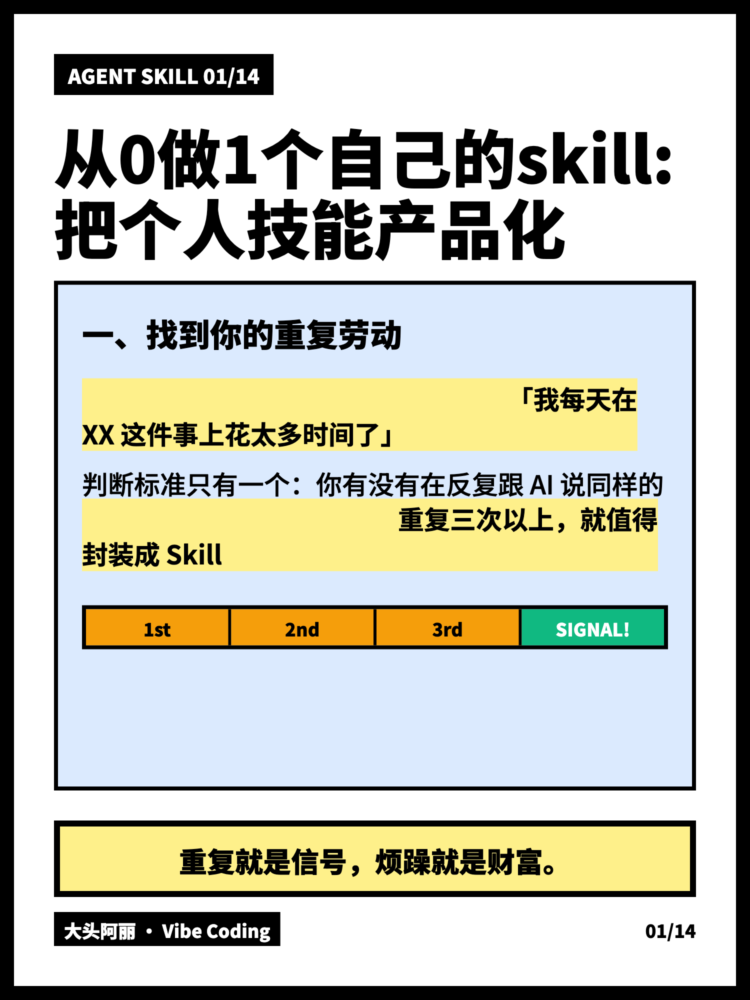

<details>
<summary>点开看全部 14 张卡片</summary>

<br>

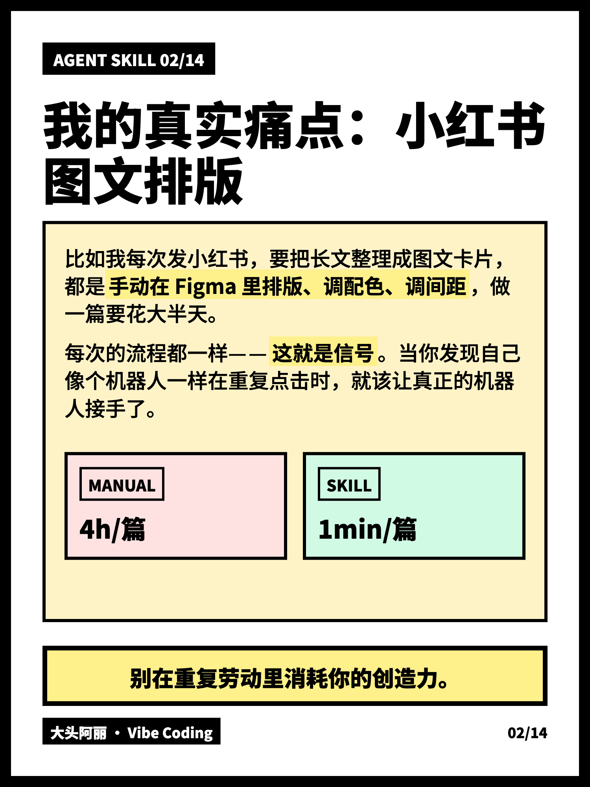
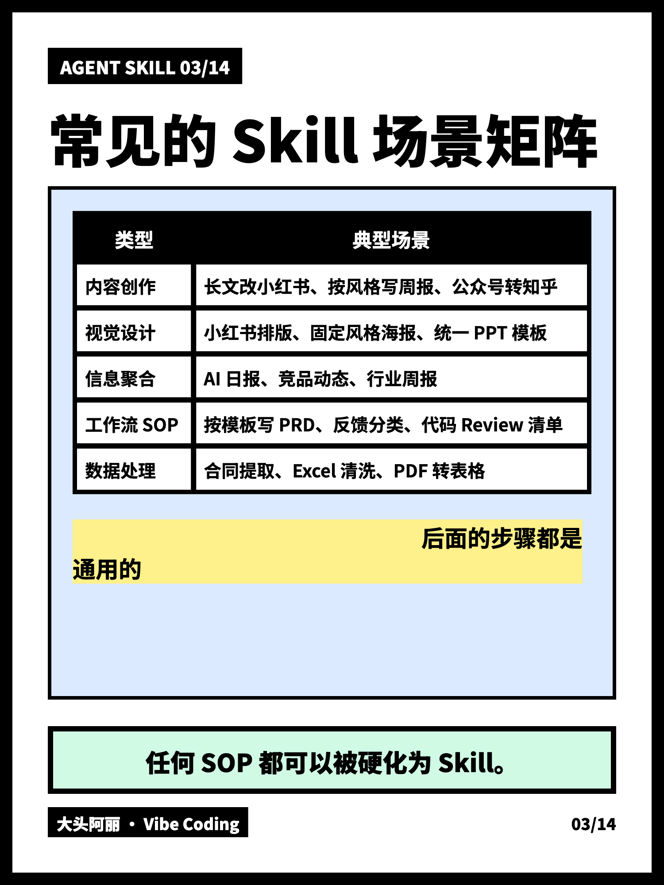
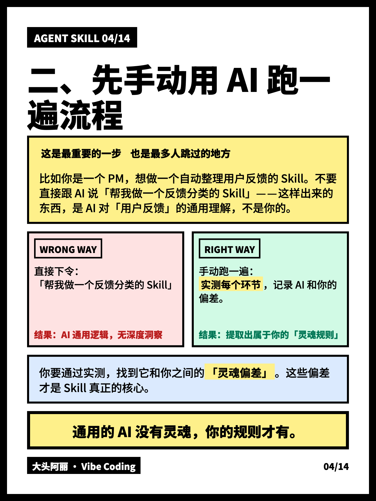
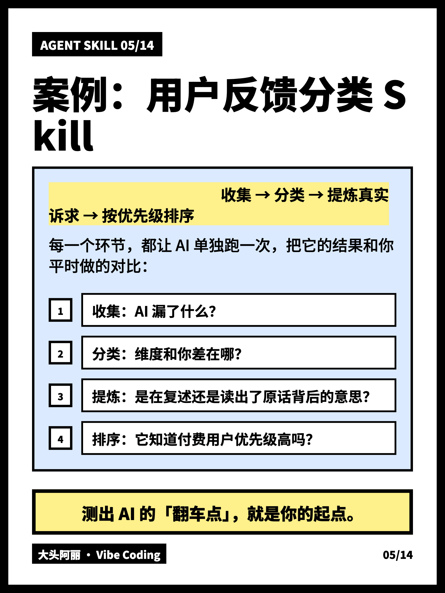
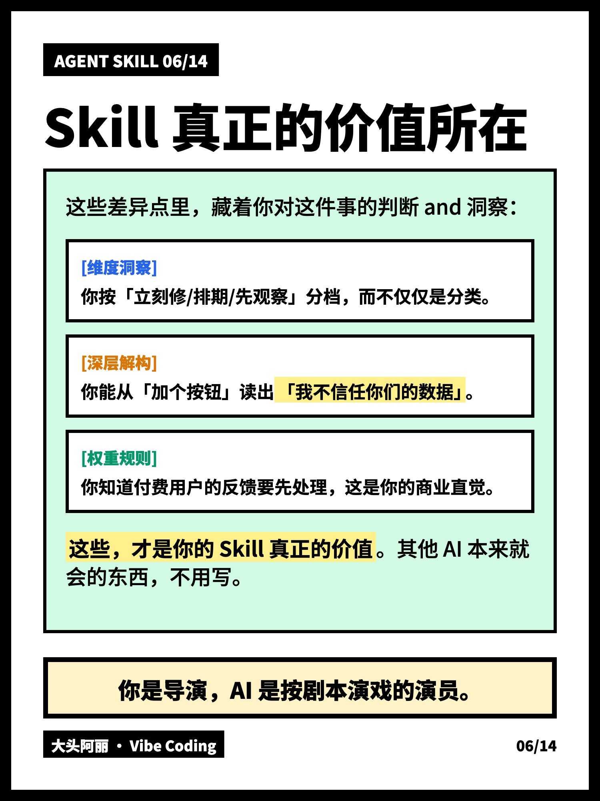
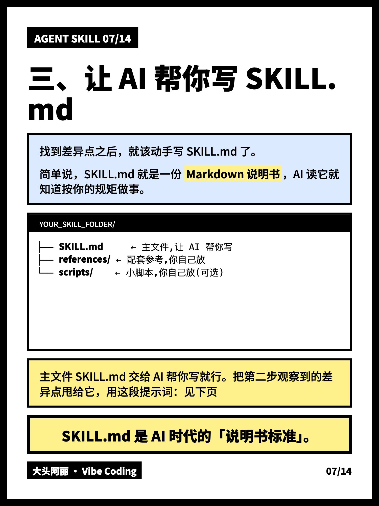
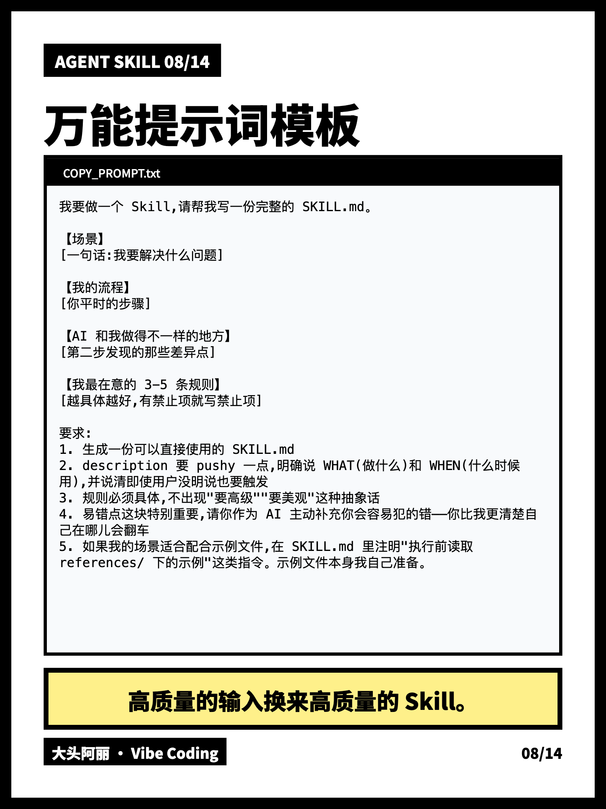
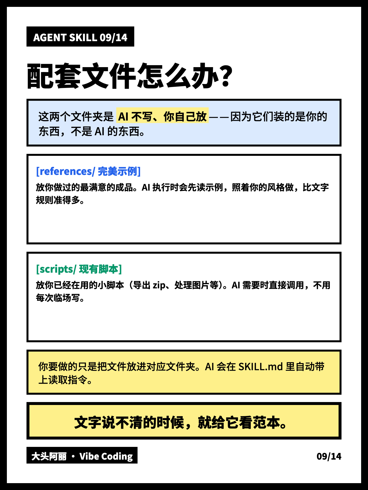
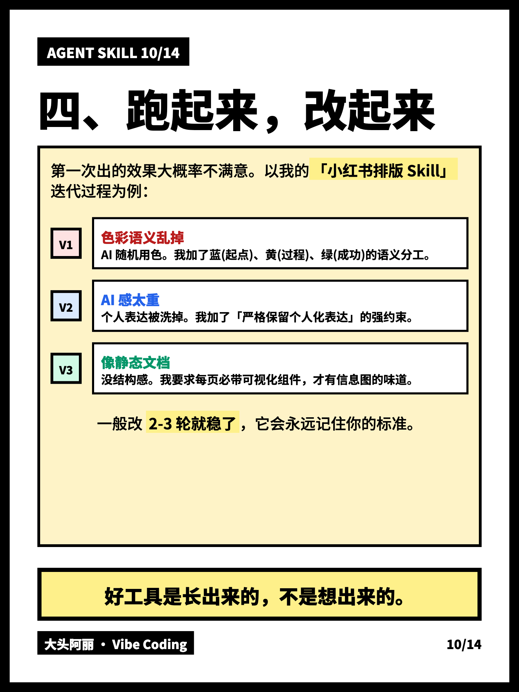
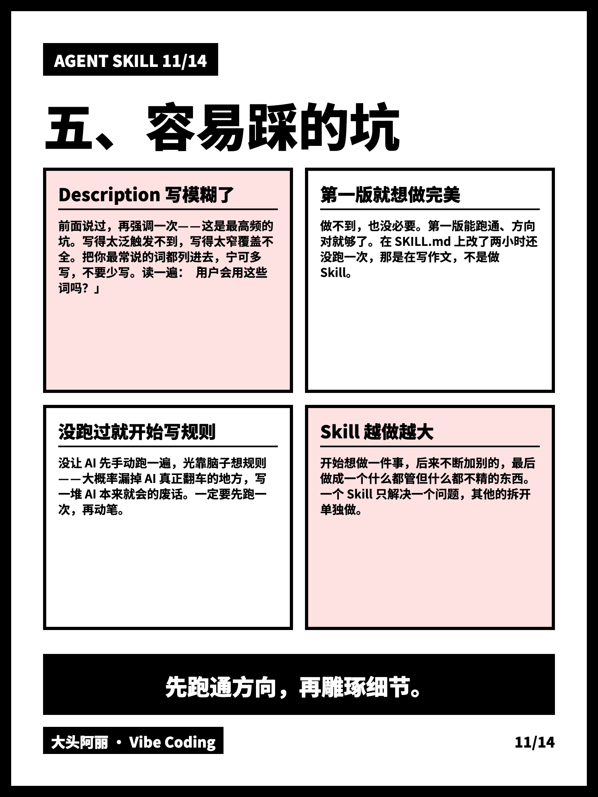
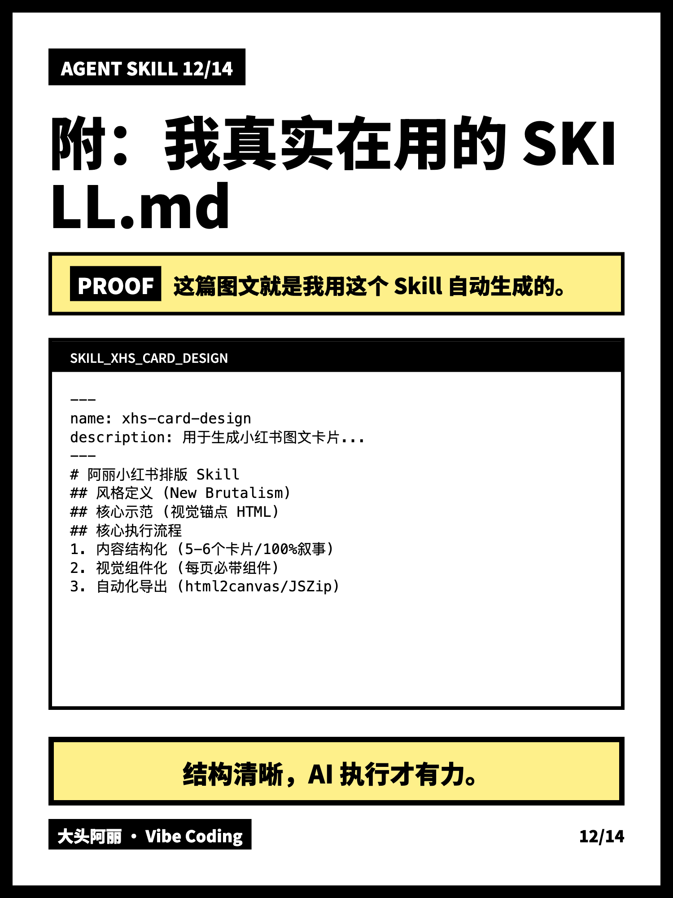
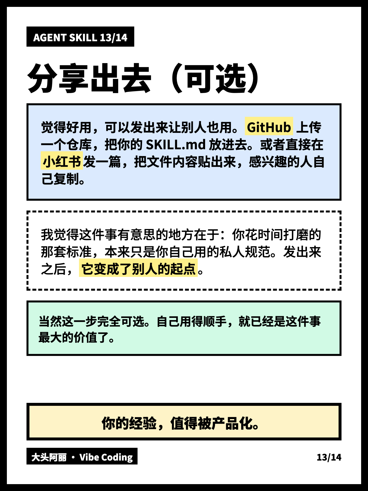
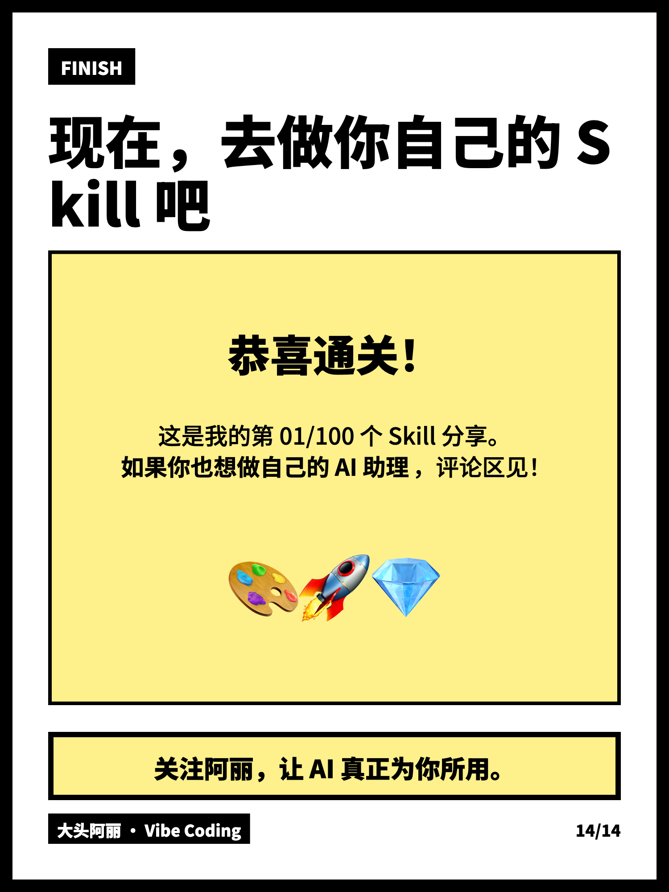

</details>

</div>

---

## 它适合谁

**适合:**
- 写好的长文 / 笔记 / 教程 → 想转成小红书图文卡片
- 想要统一风格,不每次重新调配色
- 喜欢「硬核、冲击力、技术范儿」的视觉

**不适合:**
- 你的风格是极简、治愈、温柔系 → 这个 Skill 不对味,建议 fork 改色
- 只需要单张海报 → 这个 Skill 是为多页卡片设计的(1–19 张)

---

## 安装

### Claude Code

```bash
# 全局(所有项目都能用,推荐)
git clone https://github.com/chestnut1133-lab/xiaohongshu-infographic.git \
  ~/.claude/skills/xiaohongshu-infographic
```

重启 Claude Code 自动识别,不需要手动激活。

### Claude.ai 网页版

1. 下载本仓库(右上角 Code → Download ZIP)
2. 解压后把 `xiaohongshu-infographic` 文件夹**重新压缩**成 zip
3. 打开 Settings → Capabilities → Skills 上传
4. 需要 Pro 或以上版本,且开启 Code Execution

### OpenClaw

```bash
git clone https://github.com/chestnut1133-lab/xiaohongshu-infographic.git \
  ~/.openclaw/workspace/skills/xiaohongshu-infographic
```

启动新 session 生效。

### OpenCode

```bash
# 全局
git clone https://github.com/chestnut1133-lab/xiaohongshu-infographic.git \
  ~/.config/opencode/skills/xiaohongshu-infographic

# 或项目级
git clone https://github.com/chestnut1133-lab/xiaohongshu-infographic.git \
  .opencode/skills/xiaohongshu-infographic
```

OpenCode 也兼容 `.claude/skills/` 路径,已装过 Claude Code 版本的话无需重复安装。

---

## 怎么用

把文章扔给 AI,加一句触发话即可。**不用显式说"用 skill"**:

```
下面这篇文章帮我转成小红书图文卡片:

[粘贴你的文章]
```

或者:

```
帮我把这篇文章做成小红书出图
```

AI 会自动识别、读取视觉锚点、生成一个完整的 HTML 文件,
里面带导出按钮,点击一键打包下载所有卡片。

---

## 自定义

这个 Skill 设计成可以 fork 改成你自己的风格。常见改点:

| 想改的地方 | 改哪里 |
|-----------|--------|
| 主题配色 | `SKILL.md` 第 1 节色彩逻辑 + `references/reference.html` 的 `:root` 变量 |
| 卡片比例 | `references/reference.html` 里 `.canvas` 的 `width / height` |
| 字号红线 | `SKILL.md` 第 3 节字号红线 |
| Vibe Tag 署名 | 全局搜索「大头阿丽 · Vibe Coding 系列」替换为你自己的 |
| 页数上限 | `SKILL.md` 第 3 节「页数硬红线」(默认 19 张) |

改完记得同步更新 `SKILL.md` 里的规则描述,
不然 AI 可能按旧规则生成,跟新的视觉锚点不一致。

---

## 文件结构

```
xiaohongshu-infographic/
├── SKILL.md              # 主文件,规则 + 触发条件
├── README.md             # 你正在看的这份
├── LICENSE               # MIT
├── references/
│   └── reference.html    # 视觉锚点,AI 执行前必读
└── examples/             # 14 张真实作品截图
```

---

## 作者

<div align="center">

**大头阿丽** · Vibe Coding 系列 1/100

<br>

[](https://www.xiaohongshu.com/user/profile/653c760900000000060041bc)
[](#)

<br>

**加微信 `aliaigc` 备注「进群」**
<br>
拉你进 AI 粉丝群——每天聊新工具、玩法、资讯,都是真实在用 AI 的人。

<br>

---

MIT License · 随便用、随便改、随便商用 · 署名不强制但很感谢 🧡

</div>
